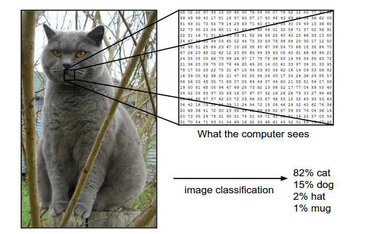
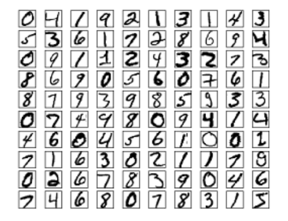
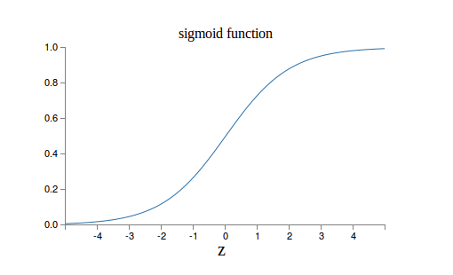
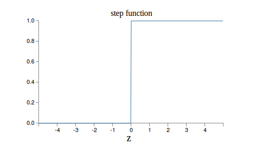
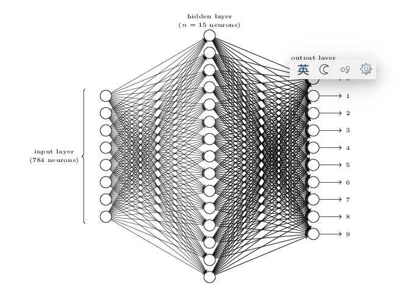

# 机器学习基本概念

## 1. 简介
大家可能平时都写过很多程序，写程序和机器学习的思路可能有一些不同。写程序时，我们是“上帝”，我们规定计算机的每一个步骤，第一步做什么第二步做什么，我们称之为算法。我们能够控制所有的情况，如果出了任何问题，肯定都是程序员的责任。而在机器学习的时候，我们只是“老师”。我们告诉学生（计算机）输入是什么，输出是什么，然后期望它能够学到和我们类似的知识。比如我们跟小孩说这是狗，那是猫，我们没有办法像上帝那样拿着“纳米手术刀”去操作人脑神 经元的连接方式。我们只能不断的给小孩“训练数据”，然后期望他能够学会什么是猫，即使我们觉得他“学会”了识别猫，我们也没有办法知道他是“怎么”学会 的，而且同样的训练过程可能换一个人就不好使。

机器学习和人类的学习是类似的——我们也是给它训练数据，然后期望它能学会。我们会给机器建一个模型，从数学的角度来说一个模型就是一个函数，它的输入一般是一个向量【当然可以是二维的矩阵如图片或者三维的张量比如视频】，输出可以是有限的离散的标签如“猫”，“狗”，这类问题我们称之为分类；而如果输出 是连续的值比如用这个模型来预测气温，那么我们就称之为回归。其实人类的很多科学活动和日常生活，都是在“学习”模型和“应用”模型。比如开普勒通过观测 大量天文数据“归纳”出行星的运动规律。从本质上讲，智能就是从“过去”学习，然后根据“现在”来预测可能的将来并根据自己的目标选择有利于自己行为。只不过之前，似乎只有人类能够从数据中“学习”出规律，而人工智能的目标就是让机器也有类似的学习能力。

模型用数学来说就是一个函数，我们人脑的函数由神经元的连接构成，它可能是一个很复杂的函数，我们现在还很难彻底研究清楚。神经网络就是试图通过计算机来 模拟和借鉴人脑这个模型，除了我们这里要讲的神经网络之外，机器学习领域还有各种各样的模型，它们各有特点。但不管形式怎么变化，本质都是一个函数。一个（或者更准确的是一种）模型一般都是一种函数形式，它有一些“参数”可以改变。而学习的过程就是不断调整这些参数，使得输出（尽量）接近“正确”的答案。 但是一般情况下很难所有的数据我们都能预测正确，所以一般我们会定义一个loss function，可以理解为“错误”的程度，错的越“离谱”，loss就越大。而我们的目标就是调整参数使得loss最小。

但是我们是在“训练”数据上调整的参数，那么它能在“测试”数据上也表现的好吗？这个就是模型的“泛化”能力了。就和人在学校学习一样，有的同学做过的一 模一样的题就会，但是考试时稍微改变一下就不会了，这就是“泛化”能力太差，学到的不是最本质的东西。所以平时会定期有一些“模拟考试”，来检验学生是不 是真的学会了，如果考得不好，那就打回去重新训练模型调整参数。这在机器学习里对应的就是validation的阶段。最后到最终的考试了，就是最终检验 的时候了，这个试卷里的题目是不能提前让人看到的，只能拿出来用一次，否则就是作弊了。对应到机器学习里就是test阶段。

当然这里用通俗的话描述了机器学习，主要是有监督的学习。其实机器学习还有无监督的学习和强化学习。前者就是不给答案，只给数据，让人总结规律；而后者会有答案，但是答案不是现在就告诉你。我个人觉得人类社会里更多的是监督学习和强化学习。从人类社会总体来说，强化学习是获取新知识的唯一途径，也就是向自 然学习，我们做了一个决策，其好坏可能要很长一段时间才能显现出来。而学习出来的这些知识通过监督的方式，通过家庭和学校的教育教给下一代。

另外输出除了简单的分为离散和连续，还可以是序列（时序）的，比如自然语言（文本）是一个字符串的序列 ，对于我们的Image Caption Generation就是生成一个单词序列。另外还有更复杂的输出，比如parsing，输出是一棵语法树。

## 2. 多层神经网络

前面介绍了机器学习的基本概念，接下来我们就来学习一下神经网络。现在流行的说法“深度学习”，其实大多指的就是“深度神经网络”，那么首先我们先了解一下“浅度神经网络”，也就是传统的神经网络。这里的内容主要来自http://neuralnetworksanddeeplearning.com的前两章。
### 2.1 手写数字识别问题

我们在学习一门新的语言时会写一个hello world程序，而mnist数据的手写数字识别就是一个很好的学习机器学习（包括深度学习）的一个hello world任务。

计算机和人类大脑似乎有很大的不同，很多人类认为复杂的工作计算机可能认为很简单，而人类认为很简单的事情计算机可能非常难处理。比如数字的计算，记忆，人类的准确度和速度都远远不如计算机。但是识别0-9的手写数字，我们觉得很轻而易举的事情，让计算机程序来处理却异常困难。经过数百万年进化的人类视觉系统在我们大脑没有意识到的时候就已经帮我们完成了数字的识别，把那些复杂的视觉处理过程深深的掩藏了起来。但当我们想自己写一个程序来识别数字的时候，这些困难才能体现出来。首先，对于计算机来说，它“看到”的不是数字，甚至不是笔画。它“看到”的只是一个二位的矩阵（数组），每个点都是一个数字。比如下图，我们“看到”的是左边的“猫”，其实计算机“看到”的是右边的像素灰度值。当然我们视觉系统的视网膜看到的也是类似的一些“数值”，只不过我们的视觉系统已经处理了这些信息并且把它识别成了“猫”（甚至和语言还做了映射）。 

 

MNIST数据介绍：MNIST的每个图片经过缩放和居中等预处理之后，大小是28*28，每个点都是0-255的灰度值，下图是一些样例。总共有60,000个训练数据（0-9共10个类别，每个类别6,000个）和10,000个测试数据。一般会拿60000个中的50000个来做训练集，而剩下的10000个用来做验证集（用来选择一些超参数）。
 

如果我们自己来写一个“算法”识别数字“9”，我们可能会这么定义：9在上面有个圆圈，在这个圆圈的右下部分有一个竖直的笔画。说起来很简单，如果用算法 来实现就很麻烦了：什么是圆圈？每个人画的圆圈都不同，同样竖直的笔画怎么识别，圆圈和竖直笔画连接处怎么寻找，右下是哪？大家如果有兴趣可以尝试一下用 上面的方法，其实最早做数字识别就是这样的思路。

机器学习的思路则不同，它不需要这么细节的“指示”计算机应该怎么做。而是给计算机足够的“训练”样本，让它“看”不同的10个数字，然后让它“学”出 来。前面我们也讲了，现在的机器学习一般是一个参数化的模型。比如最简单的一个线性模型：f(w;x)=w0+ w1*x1+w2*x2。如果我们的输入有两个“特征”x1和x2，那么这个模型有3个参数w0,w1和w2，机器学习的过程就是选择“最优”的参数。对 于上面的mnist数据，输入就是28*28=784维的向量。

如果用“原始”的输入作为“特征”，线性的模型很可能学到一些简单的特征，比如它看到1一般是分布在从上到下居中的一些位置，那么对于这些位置一旦发现有比较大的灰度值，那么就倾向于判断成1。如果一个像素点2也经常出现，但3不出现，那么它就能学到如果这个像素出现，那么这个数字是2和3的可能性就大一些。

但是这样的“特征”可能不是“本质”的，因为我写字的时候笔稍微平移一点，那么你之前“学到”的参数就可能有问题。而更“本质”的特征是什么呢？可能还是像之前我们总结的——9在上面有个圆圈，在这个圆圈的右下部分有一个竖直的笔画。我们把识别一个数字的问题转化成圆圈和竖直笔画的问题。传统的机器学习需要方法来提取“类似”（但不完全是）基本笔画这样的“特征”，这些特征相对于像素的特征会更加“本质”。但是要“提取”这些特征需要很多的“领域”知识，比如图像处理的技术。所以使用传统的机器学习方法来解决问题，我们不但需要很多机器学习的知识，而且也需要很多“领域”的知识，同时拥有这两方面的知识是比较难的。

而“深度学习”最近之所以火热，其中很重要的一个原因就是对于很多问题，我们只需要输入最原始的信号，比如图片的像素值，通过“多层”的网络，让底层的网络学习出“底层”的特征，比如基本的形状，而中间的层学习出抽象一点的特征，比如眼睛鼻子耳朵。而更上的层次识别出这是一个猫还是一个狗。所有这些都是机器学习出来的，所以基本不需要领域的知识。


     
  上面的图就说明了这一点，而且我们发现越是底层的特征就越“通用”，不管是猫鼻子还是狗眼睛，可能用到的都是一些基本的形状，因此我们可以把这些知识（特征）transfer到别的任务，也就是transfer learning，后面我们讲到CNN的时候还会提及。
     
### 2.2 单个神经元和多层神经网络(MLP)   
  
  神经网络从名字来看是和人类的大脑有些关系的，而且即使到现在，很多有用的东西如CNN和Attention，都有很多借鉴神经科学研究人脑的结果的。不过这里我就不介绍这些东西了，有兴趣的读者可以找一些资料来了解。

一个神经元如下图的结构：


它的输入是一个向量，(x1,x2,x3)，输出是一个标量，一个实数。z=w0+ w1*x1 + w2*x2 + w3*x3。z是输入的加权累加，权值是w1,w2,w3，w0是bias，输出 output = f(z)。函数f一般叫做激活函数。最早流行的激活函数是Sigmoid函数，当然现在更流行Relu和它的改进版本。Sigmoid函数的公式和图形如下：
$$\sigma(z)=\frac{1}{1+e^{-z}}
$$
 

当z=0时，sigmoid(z)=0.5 z趋于无穷大时，sigmoid(z)趋近于1，z趋于负无穷，值趋于0。为什么选择这样的激活函数呢？因为是模拟人脑的神经元。人脑的神经元也是把输入的信号做加权累加，然后看累加和是否超过一个“阈值”。如果超过，继续向下一个神经元发送信号，否则就不发送。因此人脑的神经元更像是一个阶跃函数：

 
最早的感知机(Perception)其实用的就是这个激活函数。但是它有一个缺点就是0之外的所有点的导数都是0，在0点的导数是无穷大，所以很难用梯度的方法优化。而Sigmoid函数是处处可导。下面我手工推导了一下，如果大家不熟悉可以试着推导一下Sigmoid函数的导数，我们后面也会用到。

【此处缺推导过程】

我们把许多的单个神经元按照层次组织起来就是多层的神经网络。
 

比如我们的手写数字识别，输入层是784维，就是神经网络的地一层，然后中间有15个hidden（因为我们不知道它的值）神经元，然后输出层是10个神经元。中间隐层的每个神经元的输入都是784个原始像素通过上面的公式加权累加然后用sigmoid激活。而输出层的每一个神经元也是中间15个神经元的累加然后激活。上面的图就是一个3层的神经网络。

输入一个28*28的图像，我们得到一个10维的输出，那么怎么分类呢？最直接的想法就是把认为最大的那个输出，比如输出是（10,11,12,13,14,15,16,17,18,19)，那么我们认为输出是9。

当然，更常见的做法是最后一次经过线性累加之后并不用Sigmoid函数激活，而是加一个softmax的函数，让10个输出加起来等于1,这样更像一个 概率。而我们上面的情况，虽然训练数据的输出加起来是1,但是实际给一个其它输入，输出加起来很可能不是1。不过为了与Nielsen的文章一致，我们还 是先用这种方法。

因此，假设我们有了这些参数【总共是784*15 + 15(w0或者叫bias) + 15*10 + 10】，我们很容易通过上面的公式一个一个的计算出10维的输出。然后选择最大的那个作为我们识别的结果。问题的难点就在怎么 选择这么多参数，然后使得我们分类的错误最少。

而我们怎么训练呢？对于一张图片，假设它是数字“1”，那么我们期望它的输出是（0,1,0,0,0,0,0,0,0,0)，所以我们可以简单的用最小平方错误作为损失函数。不过你可能会有些疑问，我们关注的指标应该是分类的“正确率”（或者错误率），那么我们为什么不直接把分类的错误率作为损失函数呢？这样神经网络学习出来的参数就是最小化错误率。

主要的原因就是错误率不是参数的连续函数。因为一个训练数据如果分类正确那么就是1，否则就是0，这样就不是一个连续的函数。比如最简单的两类线性分类器，f(x)=w0+w1*x1+w2*x2。如果f(x)>0我们分类成类别1；否则我们分类成类别2。如果当前的w0+w1*x1+w2*x2<0，我们很小的调整w0(或者w1,w2)，w0+w1*x1+w2*x2仍然小于0，【事实上对于这个例子，只要是w0变小，他们的累加都是小于0的】所以f(x)的值不会变化，而w0一直增大到使累加和等于0之前都不会变化，只有大于0时突然变成1了，然后一直就是1。因此之前的错误率都是1，然后就突然是0。所以它不是个连续的函数。

因为我们使用的优化算法一般是（随机）梯度下降的算法，在每次迭代的时候都是试图做一个微小的参数调整使得损失变小，但是不连续的函数显然也不可导，也就没法用这个算法来优化参数。

因此我们使用了最小平方误差(MSE)损失函数。
$$
C(w,b)=\frac{1}{2n} \sum{_x}{}||y(x)-a||^2
$$

y(x)就是神经网络的输出，可能写成f(x)大家会习惯一点。a是目标的输出，比如当前分类是数字1，那么我们期望的输出就是（0,1,0,0,0,0,0,0,0,0)。

首先这个损失函数是参数w的连续函数，因为y(x)就是神经网络的输出，每个神经元都是它的输入的线性加权累加，然后使用sigmoid激活函数【如果使用最早的阶跃函数就不连续了，所以后来使用了Sigmoid函数】，然后每一层的神经元都是用上一层的神经元通过这样的方式计算的（只不过每个神经元的参数也就是权重是不同的数值而已），所以这些连续函数的复合函数也是连续的。

其次这个损失函数和我们的最终优化目标是“大致”一致的。比如C(w,b)趋于0时，它就要求y(x)趋于a，那么我们的分类也就趋于正确。当然可能存在一种极端的情况，比如有3个训练数据，第一组参数，它分类正确了2个训练数据，但是错的那1个错的很“离谱”，也就是y(x)和a差距极大；而第二组参数，他正确分类了1个训练数据，但是错的那两个都还不算太差。那么这种情况下MSE和正确率并不一致。

### 2.3 随机梯度下降(Stochastic Gradient Descent)和自动求梯度(Automatic Derivatives)
上面说了，我们有了一个参数化的模型，训练的过程就是根据训练数据和loss function，选择“最优”的参数，使得loss“最小”，这从数学上来讲就是一个优化问题。这看起来似乎不是什么值得一提的问题，也许你还记得微积 分里的知识，极值点的各种充分必要条件，比如必要条件是导数是0，然后直接把参数解出来。但在现实生活中的函数远比教科书里学到的复杂，很多模型都无法用 解析的方式求出最优解。所以现实的方法就是求“数值”解，一般最常见的方法就是迭代的方法，根据现在的参数，我们很小幅度的调整参数，使得loss变小一 点点。然后一步一步的最终能够达到一个最优解（一般是局部最优解）。那怎么小幅调整呢？像闷头苍蝇那样随机乱试显然效率极低。因此我们要朝着一个能使函数 值变小的方向前进。而在一个点能使函数值变小的方向有无穷多个，但有一个方向是下降速度最快的，那就是梯度。因此更常见的方法就是在当前点求函数的梯度， 然后朝着梯度的方向下降。朝梯度的方向走多远呢？一般走一个比较小的值是比较安全的，这个值就是“步长”。一般刚开始随机的初始化参数，loss比较大， 所以多走一些也没关系，但是到了后面，就不能走太快，否则很容易错过最优的点。

因为loss是所有训练数据的函数，所以求loss的梯度需要计算所有的训练数据，对于很多task来说，训练数据可能上百万，计算一次代价太大，所以一 般会“随机”的采样少部分数据，比如128个数据，求它的梯度。虽然128个点的梯度和一百万个的是不一样的，但是从概率来讲至少是一致的方向而不会是相 反的方向，所以也能使loss变小。当然这个128是可以调整的，它一般被叫做batch size，最极端的就是batch是1和一百万，那么分别就是online learning和退化到梯度下降。batch size越大，计算一次梯度的时间就越久【当然由于GPU和各种类似SSE的指令，一次计算128个可能并不比计算1个慢多少】，随机梯度和真正梯度一致 的概率就越大，走的方向就更“正确”；batch size越小，计算一次的时间就越短，但可能方向偏离最优的方向就更远，会在不是“冤枉路”。但实际的情况也很难说哪个值是最优的，一般的经验取值都是几 十到一两百的范围，另外因为计算机都是字节对齐，32,64,128这样的值也许能稍微加快矩阵运算的速度。但是实际也很多人选择10,50,100这样 的值。

除了常见的随机梯度下降，还有不少改进的方法，如Momentum，Adagrad等等，有兴趣的可以看看http://cs231n.github.io/neural-networks-3/#update ，里面还有个动画，比较了不同方法的收敛速度的比较。

通过上面的分析，我们把问题变成了怎么求loss对参数W的梯度。

求梯度有如下4种方法：

#### 1. 手工求解析解

比如 $f(x)=x^2$， $df/dx=2*x$。然后我们要求f(x)在x=1.5的值，代进去 $2*1.5=3$

#### 2. 数值解
使用极限的定义:

#### 3 . 符号计算
让机器做符号运算，实现1的方法，但是机器如果优化的不好的话可能会有一些不必要的运算。

比如 x^2 + 2*x*y + y^2，直接对x求导数变成了 2*x + 2*y，两次乘法一次加分，但是我们可以合并一下变成2*（x+y)，一次乘法一次加分。

#### 4. 自动梯度
后面会详细介绍，这里先跳过

这些方法的优缺点：手工求解“数学”要求高，有可能水平不够求不对，但效率应该是能最优的。

数值解任何函数，甚至没有解析导数的情况下都能使用，缺点是计算量太大，而且只是近似解【因为极限的定义】，在某些特别不“连续”的地方可能误差较大。所以实际使用是很少，只是用它来验证其它方法是否正确。

机器符号计算，前面说的，依赖于这个库的好坏。
    
### 2.4 编程实战
通过上面的介绍，我们其实就可以实现一个经典的前馈(feed forward)神经网络了，这种网络结构很简单，每一层的输入是前一层的输出。输入层没有输入，它就是原始的信号输入。而且上一层的所有神经元都会连接到下一层的所有神经元，就像我们刚才的例子，输入是784，中间层是15，那么就有785*15个连接【再加上每个中间节点有一个bias】。所以这种网络有时候也加做全连接的网络（full connected)，用来和CNN这种不是全连接的网络有所区别，另外就是信号是从前往后传递，没有反馈，所以也叫前溃神经网络，这是为了和RNN这种有反馈的区别。

当然，我们还没有讲怎么计算梯度，也就是损失函数相对于每一个参数的偏导数。在下一部分我们会详细讨论介绍，这里我们先把它当成一个黑盒的函数就好了。
#### 2.4.1 体验Hello World
##### 1. 获取代码
我们这里学习一下Nielsen提供的代码。代码非常简洁，只有不到100行代码。
网址是 https://github.com/mnielsen/neural-networks-and-deep-learning
我们先把他clone下来
```
git clone https://github.com/mnielsen/neural-networks-and-deep-learning.git    
```

##### 2. 增加测试文件
创建一个 test_network1.py，输入如下代码：
```
import mnist_loader
import network

training_data, validation_data, test_data = mnist_loader.load_data_wrapper()
net = network.Network([784, 30, 10])
net.SGD(training_data, 30, 10, 3.0, test_data=test_data)
```
保存后直接运行 Python test_network1.py。这里我们让他进行了30次迭代，最终在测试数据上的准确率大概在95%左右（当然因为随机初始化参数不同，最终的结果可能有所不同）
```
Epoch 0: 8250 / 10000
Epoch 1: 8371 / 10000
Epoch 2: 9300 / 10000
......
Epoch 28: 9552 / 10000
Epoch 29: 9555 / 10000
```

### 3 代码阅读
Python代码很容易阅读，即使之前没有用过，稍微学习两天也就可以上手，而且大部分机器学习相关的代码不会用到太复杂的语言特性，基本就是一些数学的线性代数的运算。而Python的numpy这个库是用的最多的，后面阅读代码的时候我会把用到的函数做一些介绍，继续下面的阅读之前建议花十分钟阅读一下 http://cs231n.github.io/python-numpy-tutorial/。
#### 3.1 mnist_loader.load_data_wrapper函数
个函数用来读取mnist数据，数据是放在data/mnist.pkl.gz。首先这是个gzip的压缩文件，是Pickle工具序列化到磁盘的格式。不熟悉也没有关系，反正我们知道这个函数的返回值就行了。

这个函数返回三个对象，分别代表training_data，validation_data和test_data。

training_data是一个50,000的list，然后其中的每一个元素是一个tuple。tuple的第一个元素是一个784维的numpy一维数组。第二个元素是10维的数组，也就是one-hot的表示方法——如果正确的答案是数字0，那么这个10维数组就是(1, 0, 0, …)。

而validation_data是一个10,000的list，每个元素也是一个tuple。tuple的第一个元素也是784维的numpy一维数组。第二个元素是一个0-9的数字，代表正确答案是那个数字。

test_data的格式和validation_data一样。

为什么training_data要是这样的格式呢？因为这样的格式计算loss更方便一些。

#### 3.2 Network类的构造函数
我们在调用net = network.Network([784, 30, 10])时就到了init函数。为了减少篇幅，代码里的注释我都去掉了，重要的地方我会根据自己的理解说明，但是有空还是值得阅读代码里的注释。
```
class Network(object):
    def __init__(self, sizes):self.num_layers = len(sizes)
        self.sizes = sizes
        self.biases = [np.random.randn(y, 1) for y in sizes[1:]]
        self.weights = [np.random.randn(y, x)
                        for x, y in zip(sizes[:-1], sizes[1:])]
```
比如上面的参数，我们保存下来的self.num_layers=3，也就是3层的网络。每一层的神经元的个数保存到self.sizes里。接下来就是构造biases数组并随机初始化。因为输入层是没有参数的，所以是for y in sizes[1:]，我们使用了numpy的random.randn生成正态分布的随机数用来作为参数的初始值。注意这里生成了2维的随机变量。回忆一下，如果我们有30个hidden unit，那么bias的个数也是30，那就生成一个30维的1维数组就行了，为什么要是30*1的二维数组呢？其实用1维也可以，不过为了和weights一致，后面代码方便，就用二维数组了。另外weights也是一样的初始化方法，不过注意randn(y,x)而不是randn(x,y)。比如对于我们输入的[784,30,10]，weights分别是30*784和10*30的。当然其实weights矩阵转置一下也可以，就是计算矩阵乘法的时候也需要有一个转置。不同的文献可能有不同的记法，但是我们在实现代码的时候只需要随时注意矩阵的大小，检查矩阵乘法满足乘法的约束就行了，矩阵AB能相乘，必须满足的条件是Ｂ的列数等于Ａ的函数就行。

对于Nielsen的记法，矩阵的每一行就是一个神经元的784个参数，那么weights(30*784) * input(784*1)就得到30个hidden unit的加权累加。

#### 3.3 feedforward函数
给点输入a（784维），计算最终神经网络的输出（10维）。
```
def feedforward(self, a):
    """Return the output of the network if ``a`` is input."""for b, w in zip(self.biases, self.weights):
        a = sigmoid(np.dot(w, a)+b)
    return a
```
代码非常简单，这里用到了np.dot，也就是矩阵向量的乘法，此外这里有一个Sigmoid函数，这个函数的输入是numpy的ndarray，输出也是同样大小的数组，不过对于每个元素都进行了sigmoid的计算。用numpy的术语就是universal function，很多文献里一般都叫elementwise的function。我觉得后面这个名字更直接。
```
   #### Miscellaneous functionsdef sigmoid(z):
    """The sigmoid function."""return 1.0/(1.0+np.exp(-z))

def sigmoid_prime(z):
    """Derivative of the sigmoid function."""return sigmoid(z)*(1-sigmoid(z))
```
上面就是Sigmoid函数，另外也把sigmoid_prime，也就是Sigmoid的导数放在了一起【不记得的话看前面Sigmoid的导数的推导】。

#### 3.4 3.4 SGD函数
这个函数是训练的入口，比如我们之前的训练代码：
```
net.SGD(training_data, 30, 10, 3.0, test_data=test_data)


def SGD(self, training_data, epochs, mini_batch_size, eta,
        test_data=None):
if test_data: n_test = len(test_data)
    n = len(training_data)
    for j in xrange(epochs):
        random.shuffle(training_data)
        mini_batches = [
            training_data[k:k+mini_batch_size]
            for k in xrange(0, n, mini_batch_size)]
        for mini_batch in mini_batches:
            self.update_mini_batch(mini_batch, eta)
        if test_data:
            print "Epoch {0}: {1} / {2}".format(
                j, self.evaluate(test_data), n_test)
        else:
            print "Epoch {0} complete".format(j)
```
第一个参数就是training_data。

第二个参数就是epochs，也就是总共对训练数据迭代多少次，我们这里是30次迭代。

第三个参数是batch大小，我们这里是10，最后一个参数是eta，也就是步长，这里是3.0。除了网络结构（比如总共多少个hidden layer，每个hidder layer多少个hidden unit），另外一个非常重要的参数就是步长。前面我们也讨论过了，步长太小，收敛速度过慢，步长太大，可能不收敛。实际的情况是没有一个万能的准则，更多的是根据数据，不停的尝试合适的步长。如果发现收敛太慢，就适当调大，反之则调小。所以要训练好一个神经网络，还是有很多tricky的技巧，包括参数怎么初始化，激活函数怎么选择，比SGD更好的优化算法等等。

第四个参数test_data是可选的，如果有（我们的例子是穿了进来的），则每次epoch之后都测试一下。

代码的大致解释我用注释的形式嵌在代码里了：
```
    for j in xrange(epochs): ## 一共进行 epochs=30 轮迭代
        random.shuffle(training_data)  ## 训练数据随机打散
        mini_batches = [
            training_data[k:k+mini_batch_size]
            for k in xrange(0, n, mini_batch_size)] ## 把50,000个训练数据分成5,000个batch，每个batch包含10个训练数据。
        for mini_batch in mini_batches: ## 对于每个batch
            self.update_mini_batch(mini_batch, eta) ## 使用梯度下降更新参数
        if test_data: ## 如果提供了测试数据
            print "Epoch {0}: {1} / {2}".format(
                j, self.evaluate(test_data), n_test) ## 评价在测试数据上的准确率
        else:
            print "Epoch {0} complete".format(j)
```
下面是evaluate函数：
```
def evaluate(self, test_data):
    test_results = [(np.argmax(self.feedforward(x)), y)
                    for (x, y) in test_data]
    return sum(int(x == y) for (x, y) in test_results)
```
对于test_data里的每一组(x,y)，y是0-9之间的正确答案。而self.feedforward(x)返回的是10维的数组，我们选择得分最高的那个值作为模型的预测结果np.argmax就是返回最大值的下标。比如x=[0.3, 0.6, 0.1, 0, ….]，那么argmax(x) = 1。

因此test_results这个列表的每一个元素是一个tuple，tuple的第一个是模型预测的数字，而第二个是正确答案。

所以最后一行返回的是模型预测正确的个数。

#### 3.5 update_mini_batch函数
```
def update_mini_batch(self, mini_batch, eta):
nabla_b = [np.zeros(b.shape) for b in self.biases]
    nabla_w = [np.zeros(w.shape) for w in self.weights]
    for x, y in mini_batch:
        delta_nabla_b, delta_nabla_w = self.backprop(x, y)
        nabla_b = [nb+dnb for nb, dnb in zip(nabla_b, delta_nabla_b)]
        nabla_w = [nw+dnw for nw, dnw in zip(nabla_w, delta_nabla_w)]
    self.weights = [w-(eta/len(mini_batch))*nw
                    for w, nw in zip(self.weights, nabla_w)]
    self.biases = [b-(eta/len(mini_batch))*nb
                   for b, nb in zip(self.biases, nabla_b)]
```
它的输入参数是mini_batch【size=10的tuple(x,y)】和eta【3.0】。
```
def update_mini_batch(self, mini_batch, eta):
nabla_b = [np.zeros(b.shape) for b in self.biases]
  ## 回忆一下__init__，biases是一个列表，包含两个矩阵，分别是30*1和10*1
  ## 我们先构造一个和self.biases一样大小的列表，用来存放累加的梯度（偏导数） 
    nabla_w = [np.zeros(w.shape) for w in self.weights]
  ## 同上， weights包含两个矩阵，大小分别是30*784和10*30 
    for x, y in mini_batch:
        delta_nabla_b, delta_nabla_w = self.backprop(x, y)
     ## 对于一个训练数据(x,y)计算loss相对于所有参数的偏导数
        ## 因此delta_nabla_b和self.biases， nabla_b是一样大小(shape)
        ## 同样delta_nabla_w和self.weights,nabla_w一样大小
        nabla_b = [nb+dnb for nb, dnb in zip(nabla_b, delta_nabla_b)]
        ## 把bias的梯度累加到nabla_b里
        nabla_w = [nw+dnw for nw, dnw in zip(nabla_w, delta_nabla_w)]
        ## 把weight的梯度累加到nable_w里
    self.weights = [w-(eta/len(mini_batch))*nw
                    for w, nw in zip(self.weights, nabla_w)]
     ## 使用这个batch的梯度和eta（步长）更新参数weights
    self.biases = [b-(eta/len(mini_batch))*nb
                   for b, nb in zip(self.biases, nabla_b)]
        ## 更新biases
        ## 这里更新参数是除了batch的大小（10），有的人实现时不除，其实没有什么区别，因为超参数eta会有所不同，如果不除，那么eta相当于是0.3(在eta那里就除了batch的大小了）。
```
#### 3.6 backprop函数
这个函数就是求loss相对于所有参数的偏导数，这里先不仔细讲解，等下次我们学习梯度的求解方法我们再回来讨论，这里可以先了解一下这个函数的输入和输出，把它当成一个黑盒就行，其实它的代码也很少，但是如果不知道梯度的公式，也很难明白。
```
def backprop(self, x, y):
nabla_b = [np.zeros(b.shape) for b in self.biases]
    nabla_w = [np.zeros(w.shape) for w in self.weights]
    # feedforwardactivation = x
    activations = [x] # list to store all the activations, layer by layerzs = [] # list to store all the z vectors, layer by layerfor b, w in zip(self.biases, self.weights):
        z = np.dot(w, activation)+b
        zs.append(z)
        activation = sigmoid(z)
        activations.append(activation)
    # backward passdelta = self.cost_derivative(activations[-1], y) * \
        sigmoid_prime(zs[-1])
    nabla_b[-1] = delta
    nabla_w[-1] = np.dot(delta, activations[-2].transpose())
for l in xrange(2, self.num_layers):
        z = zs[-l]
        sp = sigmoid_prime(z)
        delta = np.dot(self.weights[-l+1].transpose(), delta) * sp
        nabla_b[-l] = delta
        nabla_w[-l] = np.dot(delta, activations[-l-1].transpose())
    return (nabla_b, nabla_w)
```

它的输入就是一个训练样本(x,y)分别是784*1和10*1。输出就是和self.biases,self.weights一样大小的列表，然后列表中的每一个数组的大小也是一样。具体到上面的例子，输出nabla_b包含两个矩阵，大小分别是30*1和10*1；nabla_w也包含两个矩阵，大小分别是30*784和10*30。

