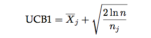
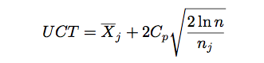
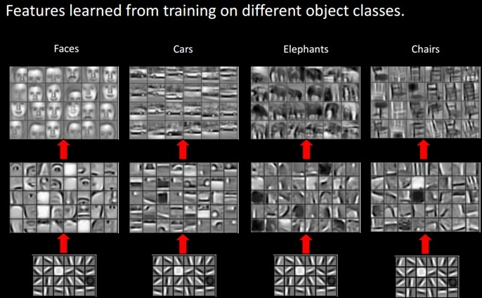
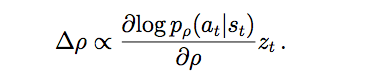
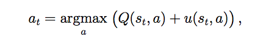
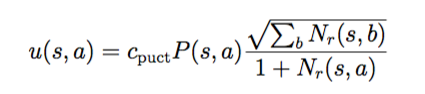
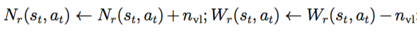
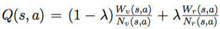
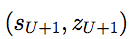
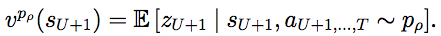

# 棋类游戏，从深蓝到AlphaGo
## 1. 象棋与围棋的比较
### 1.1 俗与雅
如果你在公园或家门口看到一群人围成一团，围观的比下棋的还多，并且出谋划策指手画脚，那一定是象棋。同样在路边摊上摆“祖传”残局的也一定是象棋。围棋则“高雅”的多，所以琴棋书画里的棋必然是围棋。象棋下得好，也只能在民间摆摆路边摊。而围棋专门有个官职叫“棋待诏”，陪皇帝下棋的。当然伴君如伴虎，陪皇帝下棋可没有与路边的大爷下棋轻松，赢了皇帝肯定不行，但老是输或者输得太假了也不行。要像贾玄那样让皇帝每次都觉得自己棋差一着，可不是简单的事情。喜欢下围棋的皇帝很多，比如传说中“一子定乾坤”的李世民，《西游记》里魏征梦斩泾河龙王时也是在和李世民下棋。即使围棋下不到国手的水平能陪皇帝下棋，还是有很多达官贵人也附庸风雅的。比如《红楼梦》里的贾政老爷，那么无趣的人，也是要下下围棋的，因此很多詹光这样的门客。贾府四位大小姐的丫鬟是琴棋书画，迎春的丫鬟是司棋，按说迎春下棋应该很厉害，不过在书中并没有写迎春下棋，倒是写惜春和妙玉下棋，惜春在角上被倒脱靴。另外探春和宝琴下棋，“探春因一块棋受了敌，算来算去，总得了两个眼，便折了官着儿，两眼只瞅着棋盘，一只手伸在盒内，只管抓棋子作想”，因此林之孝家的来请示也未听到。
### 1.2 孰难孰易
围棋似乎更“平等”一些，每个棋子除了颜色没有什么不同，它的重要性取决于它的位置以及整个棋盘其它棋子（包括自己和对手）的整体分布。而象棋似乎不同，车一般都要比马有价值，将帅的价值无穷大，虽然它没有什么大作用。偶尔在某些特殊情况下，虎落平阳被犬欺，车的价值可能比不上一个马，但大部分情况下车都超过两个马的价值，真是“王侯将相确有种乎”！

从理想主义的角度，我更喜欢围棋，每个棋子都是同样的可塑性，它的重要性取决于它的位置。但是每个棋子的位置又是它自己能决定的吗？也许在开始一盘对局之前它的位置就大致确定了！放在棋罐里最上面的棋子当然最可能被选择，另外位置好坏更由下棋的棋手决定，棋子本身没有什么决定权。

而且从现实的角度来说个体的差异确实是存在的，打篮球的话姚明就生来比其他人有优势。

从入门的角度说，象棋的估值函数相对简单，因此入门应该更容易一些。

## 2. MiniMax搜索/Alpha-Beta剪枝和象棋
### 2.1 MiniMax
这个算法最早是冯诺依曼提出来的。其实每一个下棋的人可能都在不自觉的使用这个算法，只不过没有形式化的语言描述出来而已。

第一次下棋的时候，我们很可能尝试当前局面下所有的可能走法，然后选择最“好”的一个局面。拿象棋来说，“好”可以比较简单的用双方棋子的分值来表示，一个车的价值大致相当于两个炮，马和炮差不多，相当于两个士或者相，兵的价值最低。那么很可能我们第一次走棋时就是看哪步走法能“吃”到对方的棋子，然后就走这一步。可惜下棋是两个人的博弈，你用车吃对方一个兵，对方可能用马把你的车吃了，这样算下来，用一个车换一个兵，明显是亏了。通过这样的例子，你学到对手是在和你“作对”，你有很多走法，如果你只考虑一步，选择最好的局面，那么对手会在这个局面走对他有利的局面，有可能这个局面对你非常不利。所以你觉得应该要考虑两步也就是一个回合，首先你尝试所有的可能（当然也可能做一些裁剪，滤掉明显不好的走法，比如没事走动自己的老将），比如用车吃对手的卒，然后站在对手的角度选择对手最好的走法（用马吃你的车），然后评估一下这个局面，发现局势对你并不有利。接着再尝试用兵吃对手的马，接着对手选择用车吃你的兵，这个结果明显对你有利。

当然随着你计算能力的增强，你可能把搜索的深度从2扩展到4或者更多。
 
(from https://en.wikipedia.org/wiki/Minimax)
上面的“算法”用上图来说明。圆形的节点表示“你”面对的局面，而方块的节点表示对手面对的局面。这里是4层两个回合的搜索树。

我们从最下层第4层开始，这一层是叶子节点，不再展开，你需要评估局面的“好坏”，比如前面描述的“简单”算棋子分数的算法（其实也不那么简单，想想第一次下棋的人怎么知道？这是几千年来前人总结出来的经验！）计算出得分。

接着第3层对手从这些局面中选择他最好的局面（也就是你最坏的局面），也就是得分最少的局面（因为计算得分是从你的角度计算的）。

接着你在第2层选择得分最多的局面。

接着对手在第1层选择得分最少的局面。

最后你在第0层选择得分最多的局面。

这里忽略或者说假设了一个非常重要的东西——估值函数。也就是之前说的怎么评估一个局面的好坏。

对于一个游戏来说，局面可以分为两类：结束局面和非结束局面。比如对于象棋来说，结束局面就是一方的将/帅被吃了（实际的规则是一方的将/帅没有“合法”的走法了。但是我们总是可以假设将帅是可以走不能走的位置，然后被“吃”掉，或者将帅碰面也可以看成被吃，我小时候学下象棋的时候就是这么认为的），其它的所有合法局面都是非结束局面（现代象棋还有一些规则为了避免重复局面或者“无赖”的长将长打长捉指定了一些规则约束，高手过招时甚至会“合理”地利用这样的规则，另外在某些特殊的残棋里这些规则也会决定胜负）。

对于很多游戏来说，结束局面的好坏一般是游戏规则规定的。比如象棋的结束一般是某方的将帅被吃了，那么被吃的一方就输了，可以认为这个局面的得分是负无穷大，而相对的另一方得分是无穷大。当然实际比赛中也有和棋，也就是双方都没有办法吃掉对方的将帅或者超过自然限着的回合数。

从理论上来说，如果我们的计算能力足够，我们可以搜索到游戏的结束局面，那么我们就可以说完全“解决”了这个游戏。但是从上面的搜索过程我们可以发现，搜索的节点数是随着层次的增加指数级增加的（后面我们讨论的alph-beta剪枝能减少部分不必要的搜索，但是并不影响总的复杂度）。一般认为中国象棋的分支因子在40-50之间（也就是平均每步有这么多种合法的走法），那么搜索20步就需要40的20次方需要多久呢？我们假设计算机每秒可以搜索1G个节点(1GHz，时间一个CPU时钟周期肯定不能搜索一个节点)，那么也需要3486528500050735年！

因此，我们只能搜索有限的深度，这就带来一个问题，非结束局面的得分的计算问题。也就是给定一个局面，怎么计算“好坏”？

首先，我们需要定义这个“好坏”。定义其实非常简单，这个得分就是把这个局面搜索到结束局面的得分，基本上三种可能：胜/负/和。当然这个理论得分是不知道的，那么我们怎么近似它呢？一种最简单而且实际上我们人类一直在使用的方法就是统计的方法：我们看以往对弈的结果，如果这个局面下了100局，我方胜了60局，输了40局，那么我可能认为这个局面还不错，反之如果我方胜了30局输了70局，那么就不太好。

当然，我们统计的是“高手”的对局，如果是随机的对局，可能没有统计意义。这里其实有个鸡生蛋蛋生鸡的过程。类似于EM算法。我们首先有一个还“不错”的估值函数（人类高手），然后不停的模拟对局（下棋），然后统计新的局面得分，然后用这些局面得分更新我们的估值函数。

这样一代一代的积累下来，人类的下棋水平越来越高。这其实和下面我们要讨论的强化学习和MCTS有类似的思想！我们下面会再讨论这个问题。

比如我们有了一个基本的估值函数：计算棋子的静态得分，将10000分，车10分，马和炮5分，相士2分，兵卒1分。然后我们不断下棋，发现有些局面从棋子看双方都一样，但是棋子的不同位置会导致最终胜负的差距很大。因此我们会更新我们的估值函数：比如兵卒过河要变成两分。棋子的行动力越大分越高，越靠近中间分越高，不同的棋子如果有保护或者攻击关系，我们会增加一些分数，另外一些特殊的局面，比如空头炮，三子归边会有很高的胜率，我们也会增加分数，从而出现棋子攻杀。

因此一个棋手的棋力除了计算能力（这个更多是天赋，当然也能通过训练提高），另外一个很重要的能力就是评估局面的能力，这个就更多的靠后天的训练。而一个游戏是否“有趣”/“好玩”，其实也跟评估函数有关。如果一个游戏很容易评估，那么基本不需要搜索，看一个回合就知道最终的结果了，就没有什么意思。最有“意思”的局面是“看”起来很差但“其实”很好的棋，或者看起来某个局面很平稳，但其实某方优势很明显，所谓的“妙手”是也。什么叫“看”起来很差？就是搜索很浅的层次评估或者不搜索直接评估得分很差(比如走窝心马或者被架空头炮)，但是搜索很深之后发现这是当前局面下最好的走法，甚至是反败为胜的唯一招法。高手和低手的差别也在于此，对于那种很明显的好坏，大家都能看得出来；而有些局面，对于低手来说可能觉得局面双方还差不多，但是在高手看来胜负早已了然于胸了。

### 2.2 Alpha-Beta剪枝
 
rom https://en.wikipedia.org/wiki/Alpha%E2%80%93beta_pruning)

假设minimax是4层的深度优先搜索，并且是如图的从左到右的顺序。那么有些子树是不用搜索，可以被剪枝掉的。

比如下面这棵子树：
 
第0层是MAX操作，第一个孩子返回了5，现在我们正准备搜索第二个孩子（4的那个，当然现在还不知道）。我们知道它的只至少是5了，>=5。

它是一个MIN操作，首先搜索到7，所以它的取值<=7，接着搜索到4，所以它的取值<=4，这个时候就可以停止了，为什么？

因为第0层的节点的值已经>=5了，而第1层的右边那个节点已经<=4了，所以不管它的第三个孩子得分多少，第0层都不会选择了，所以可以把它剪枝掉了。max(5, (<=4))=5。
 
搜索完两个孩子之后，第0层的值已经>=6了，然后搜索第1层(5)的那个节点，它的第一个孩子已经返回5了，所以它的值必然<=5了，所以它的第二个孩子(8)也没有必要搜索了。因为max(6, (<=5))=6。

类似的，对手在MIN的时候也可以剪枝，min(3, (>=4))=3。

当然上面是非常形式化的描述，其实在实际的下棋过程中我们可能自觉不自觉的使用了alpha-beta剪枝。

比如，我们有这样的推理：我可以走车吃对手一个兵而且对手吃不了我任何子(得分+1)；也可以走马吃对手的卒，走马后对手有很多走法，其中一个走法是吃掉我的马而且我还吃不了他任何棋子(得分-4)，那么这个时候我就不会走马了，因为不管其余的走法怎么样(也许对手还有更好的走法，比如吃我一个车得10分；当然也有更差的走法不吃我的子让我得+1分，但他不会这么走)，这个走法下我“至少”损失一个马了，那么我现在有一个得分+1的走法，我就不要考虑对手其它的走法了，直接剪枝掉了。用形式化的语言描述 max(1, (<=-5))=1。

alpha-beta能否剪枝非常依赖于搜索的顺序，如果把最优的走法先搜索，那么能得到最大程度的剪枝。所以这个树的展开顺序非常重要。一般会使用很多启发式规则来排序。比如吃对方的棋子很可能是比较好的走法，而没事走动老将不是什么好的走法。

要下好象棋，计算能力和评估局面的能力缺一不可。因为人的计算能力有限(计算机也是一样)，所以搜索到一定层次之后需要停下来评估局面。当然人的搜索不是固定的，而是和评估函数一起工作的，对于“简单”的局面（比如明显很差或者很好的），就不要搜索很深，而对于“复杂”的局面，则会尽可能深的搜索下去。所以好的评估局面的能力对于下象棋很重要，这个容易理解。

那么计算能力（搜索深度）的重要性呢？这个似乎更加显而易见，棋经云：“多算胜，少算不胜，况乎无算。”

不过仔细思考一下，有似乎没有那么明显。为什么搜索深比搜索浅好呢？除非你能搜索到游戏结束，否则都得提前结束使用估值函数。搜索深比搜索浅好的一个隐含假设就是越深的局面越容易评估。对于象棋来说这是很明显的，因为象棋的特定是越下棋子越少，局面也就更容易评估。而围棋就不一样，棋子越到后来越多，局面的评估难度并没有明显的下降（甚至可能上升，我个人围棋水平也就是会简单规则的程度，所以很可能不是这样）。当然围棋的评估局面比象棋也复杂很多（至少我是这么觉得的）。

当然一个人的计算能力是有限的，所以“离线”的计算对于职业棋手也很重要。很多棋手对于某些布局有非常细致的研究，他们“离线”研究了各种可能的变化，因此你如果走到了他熟悉的布局，你基本上很难战胜他。因此残局库和开局库的研究和记忆是一个职业棋手努力的方向。

要设计一个好的象棋程序也是一样，首先是计算（搜索）能力，这个对于相对于人类来说是它的强项。因此更关键的就是评估局面的函数。由于象棋的局面特征还是比较明显的，静态的棋子分值估计能解决80%的局面，再加上一下位置特征（比如棋子在不同的位置有不同的加减分），棋子的行动力，棋子之间的保护关系等等，就能解决大部分的局面。那些非常复杂的局面可以通过更深的搜索层次来解决。另外像开局库，残局库这些对于计算机都不是问题，它的记忆能力远超人类。

有了这些重要的特征，可以人工设计估值函数，也可以用机器学习的方法学习更加准确的估值函数。所以解决象棋应该是“比较”容易的（相对于围棋）。所以现在国际象棋人类的水平和计算机差距越来越大，人类几乎没有获胜的可能了。

## 3. 围棋为什么不能用类似的方法
国际象棋解决之后，大家把注意力放到了围棋上。用类似的方法效果很差，比如GnuGo的棋力大概在13级(kyu)。

13级什么概念呢？从下图中可以看到是非常差的水平。
 
(from https://en.wikipedia.org/wiki/Go_ranks_and_ratings#Kyu_and_dan_ranks) 
为什么对于象棋非常有效的方法用在围棋上就不行呢？我们需要分析两种棋的差别。不过由于我本人下棋水平一般，围棋更是刚入门的水平，所以更多的是从程序员的角度来分析两种棋的差异。
### 3.1 分支因子和深度
国际象棋的分支因子是35，而围棋是250（https://en.wikipedia.org/wiki/Branching_factor）。这个数值只是估计，但可以看出大致的差别。从这个角度来说围棋要比国际象棋复杂。但如果只是这一个因素的差别不可能导致最好的国际象棋程序超过人类而围棋只有13k的水平。

### 3.2 估值函数
前面我们分析的是中国象棋，国际象棋和中国象棋类似，所以它的估值函数是相对容易和准确的。而围棋就比较困难，数棋子的个数明显是没有任何用处的。

“围棋难的地方在于它的估值函数非常不平滑，差一个子盘面就可能天翻地覆，同时状态空间大，也没有全局的结构。这两点加起来，迫使目前计算机只能用穷举法并且因此进展缓慢。但人能下得好，能在几百个选择中知道哪几个位置值得考虑，说明它的估值函数是有规律的。这些规律远远不是几条简单公式所能概括，但所需的信息量还是要比状态空间本身的数目要少得多（得多）。”
（http://www.almosthuman.cn/2016/01/12/ebfzg/）

后面我讨论用深度学习(CNN)来评估局面时会分析这两个因素哪个更重要，至少从个人感觉来看，第二个更加重要一些。

围棋和象棋的差别还是挺大的，比如MCTS搜索，在围棋中效果不错，但是用到象棋里就没有什么效果。

## 4. MCTS介绍
### 4.1 多臂老虎机(Multi-Arm Bandits)和UCB(Upper Confidence Bounds)
这是强化学习里最简单的一个问题，在很多地方都有应用，比如互联网广告(https://support.google.com/analytics/answer/2844870?hl=en)，游戏厅有一个K臂的老虎机，你可以选择其中的一个投币，每个手臂都是一个产生一个随机的奖励，它们的均值是固定的（也有Nonstationary的多臂老虎机，我这里只考虑Stationary的）。你有N次投币的机会，需要想办法获得最大的回报(reward)。

当然如果我们知道这个K个手臂的均值，那么我们每次都选择均值最大的那个投币，那么获得的期望回报应该是最大的。

可惜我们并不知道。那么我们可能上来每个都试一下，然后接下来一直选择最大的那个。不过这样可能也有问题，因为奖励是随机的，所以一次回报高不代表真实的均值回报高。当然你可以每个都试两次，估计一下奖励的均值。如果还不放心，你可以每个都试三次，或者更多。根据大数定律，试的次数越多，估计的就越准。最极端的一种做法就是每个手臂都投一样多的次数；另外一种极端就是碰运气，把所有的机会都放到一个手臂上。后一种如果运气好是最优的，但是很可能你抽到的是回报一般的甚至很差的手臂，期望的回报其实就是K个手臂的平均值。前一种呢？回报也是K个手臂的平均值！我们实际的做法可能是先每个手臂都试探几次，然后估计出比较好的手臂（甚至几个手臂），然后后面重点尝试这个(些)手臂，当然偶尔也要试试不那么好的手臂，太差的可能就不怎么去试了。但这个“度”怎么控制就是一个很复杂的问题了。这就是exploit-explore的困境(dilemma)。利用之前的经验，优先“好”的手臂，这就是exploit；尝试目前看不那么“好”的手臂，挖掘“潜力股”，这就是explore。

一种策略(Policy)的Regret(损失)为：
 
(from A Survey of Monte Carlo Tree Search Methods)
我觉得mu_j应该放到求和符号里面的。

不要被数学公式吓到了，用自然语言描述就是：最理想的情况是n次都试均值最大的那个手臂(mu star)，不过我们并不知道，E[Tj(n)]是这个策略下选择第j个手臂的期望。那么R就是期望的损失，如果我们的策略非常理想，这个策略只尝试最好的手臂，其它不试，那么R就是0。

但是这样的理想情况存在吗？很明显不太可能存在（存在的一种情况是k个手臂的均值一样）。那么我们的策略应该尽量减少这个损失。

Lai and Robbins证明了这个损失的下界是logn，也就是说不存在更好的策略，它的损失比logn小（这类似于算法的大O表示法）。

所以我们的目标是寻找一种算法，它的损失是logn的。

UCB就是其中的一种算法： 
 
每次决策之前，它都用上面的公式计算每个手臂的UCB值，然后选中最大的那个手臂。公式右边的第一项是exploit项，是第j个手臂的平均回报的估计。这个值越大我们就越有可能再次选中它。第二项是explore项，n_j是第j个手臂的尝试次数，n_j越小这个值就越大，也就是说尝试次数越少的我们就越应该多尝试。当n_j=0时，第二项为无穷大，所以这个算法会首先尝试完所有的手臂（explore），然后才会选择回报最大的那个(exploit)，试了之后这个手臂的平均值可能变化，而且n_j增加，explore值变小，接着可能还是试最大的那个，也可能是第二大的，这要看具体情况。

我们来分析一些极端的情况，一种情况是最好的（假设下标是k)比第二好的要好很多，那么第一项占主导，那么稳定了之后大部分尝试都是最好的这个，当然随着n_k的增加explore项在减少(其它手表不变)，所以偶尔也试试其它手臂，但其它手臂的回报很少，所以很快又会回到第k个手臂。但是不管怎么样，即使n趋于无穷大，偶尔也会尝试一下其它的手臂的。不过因为大部分时间都在第k个手臂上，所以直觉上这个策略还是可以的。

另一种极端就是k个手臂都差不多（比如都是一样的回报），那么exploit项大家都差不多，起决定作用的就是explore项，那么就是平均的尝试这些手臂，由于k各手臂回报差不多，所以这个策略也还不错。

出于中间的情况就是有一些好的和一些差的，那么根据分析，大部分尝试都是在好的手臂上，偶尔也会试一试差的，所以策略的结果也不会太差。

当然这个只是简单的直觉的分析，事实上可以证明这个算法的regret是logn的，具体证明细节请参看论文《Finite-time Analysis of the Multiarmed Bandit Problem》。
### 4.2 MCTS（Monte Carlo Tree Search）
 
(from A Survey of Monte Carlo Tree Search Methods)
MCTS算法就是从根节点(当前待评估局面)开始不断构建搜索树的过程。具体可以分成4个步骤，如上图所示。
####1. Selection

使用一种Policy从根节点开始，选择一个最“紧急”(urgent)的需要展开(expand)的可以展开(expandable)的节点。

说起来有点绕口，可以展开的节点是非叶子节点（非游戏结束局面），而且至少还有一个孩子没有搜索过。比如上图展示的选择过程，最终选择到的节点不一定是叶子节点（只有它还有没有搜索过的孩子就行）。具体的选择策略我们下面会讨论。
####2. Expansion

选中节点的一个或者多个孩子被展开并加入搜索树，上图的Expansion部分展示了展开一个孩子并加入搜索树的过程。
####3. Simulation

从这个展开的孩子开始模拟对局到结束，模拟使用的策略叫Default Policy。
####4. Backpropagation

游戏结束有个得分(胜负)，这个得分从展开的孩子往上回溯到根节点，更新这些节点的统计量，这些统计量会影响下一次迭代算法的Selection和Expansion。

经过足够多次数的迭代之后（或者时间用完），我们根据某种策略选择根节点最好的一个孩子（比如访问次数最多，得分最高等等）。

上面的算法有两个policy：tree policy 和 default policy。tree policy决定怎么选择节点以及展开；而default policy用于simulation（也有文献叫playout，就是玩下去直到游戏结束)

在讨论MCTS和UCT之前，我们来分析一下人在下棋时的搜索过程。

首先人的搜索肯定不是之前的固定层次的搜索的，很多“明显”不“好”的局面可能就只搜索很浅的层次，而不那么“明显”的局面可能需要搜索更深的层次（之前我们讨论过这里隐含了一个假设：深的局面比浅的局面容易评估，对于象棋这是比较明显的），“好”的局面也需要多搜索几层确保不会“看走眼”。

MCTS其实有类似的思想：我们着重搜索更urgent的孩子，所谓urgent，就是更promising的孩子。当然偶尔也要看看那些不那么promising的孩子，说不定是潜力股。这其实就有之前讨论的exploit和explore的平衡的问题。

另外MCTS直接Simulation到对局的结束，“回避”了局面评估的难题（不过这个问题最终还是绕不过去的，我们下面会再讨论）。

既然是exploit和explore的问题，那么之前我们讨论的UCB就可以直接用上了，把UCB用到MCTS就是UCT算法（注意：MCTS其实是一族算法的统称，不同的Tree Policy和Default Policy就是不同的MCTS算法）.

### 4.3 UCT算法
 
Selection和Expansion的公式如上，和UCB很类似，只是多了一个常量Cp，用来平衡exploit和explore。

每个节点v都有两个值，N(v)和Q(v)，代表v访问过的次数（每次迭代都是从root到结束状态的一条Path，这条Path上的每个点都被visit一次）和v的回报，如果这次simulation己方获胜，则Q(v)+1，否则Q(v)-1。（1，3，5…层代表自己，2，4，6…代表对手，如果最终我方获胜，1，3，5都要加一而2，4，6都要减一）。
 
具体的计算公式如上，每次选孩子时都用上面的公式计算得分。第一项就是这个节点的平均回报(exploit term)和第二项就是explore term，访问次数少的节点更应该被explore。当N(v)=0时第二项值为无穷大，所以如果某个节点有未展开的孩子，总是优先展开，然后才可能重复展开回报高的孩子。

UCT算法的特点如下：
1,  Aheuristic：不需要估值函数，因此也就不需要各种启发式规则，领域知识，从而“回避”了围棋估值函数难的问题。

2, Anytime：可以任何时候结束，迭代的次数越多就越准确。

3, Asymmetric：前面我们也分析过了，和人类的搜索类似，搜索树是不对称的，不是固定层次的，而是“重点”搜索promising的子树。

### 4.4 UCT的变种和改进
这里主要关注围棋领域的一些变种和改进。
All Moves As First（AMAF）和Rapid Action Value Estimation（RAVE）

这是很多开源MCTS围棋使用的一个变种。
 
首先通过UCT的Tree Policy我们选择了C2和A1，然后Default Policy我们选择了B1 A3 C3 最终黑棋获胜。

普通的MCTS会更新C2和A1的N(v)和Q(v)，而AMAF认为：既然在simulation的过程中黑方选择了B1和C3，在root节点时也可以选择B1和C3，那么这次模拟其实也可以认为B1和C3对获胜是有帮助的，那么root节点的B1和C3也有贡献(标志为)，也应该更新统计量，让下次选择它的概率大一点。同理白棋在simulation的时候选择了A3，在C2也可以选择A3（有的那个），那么C2对于白棋失败也是有责任的，那么下次在C2的时候白棋应该避免选择A3。这样一次迭代就能多更新一些节点（那些没有直接Selection的也有一些统计量）。

这个想法对于围棋似乎有些道理（因为不管哪个顺序很可能导致一样的局面，前提是没有吃子），而且实际效果也不错。但是在别的地方是否应该使用就需要看情况了。

这里有两类统计量：直接selection的节点的统计量(A1,C2)和间接selection的节点(B1,C3, A3)。这两种权重应该是不一样的。

所以比较直观的想法是给它们不同的权重 αA+(1−α)U 这就是α-AMAF。

这个权重α是固定的，RAVE认为随着模拟次数的增加α应该减少才对（没有真的模拟是可以用这些间接的统计量，如果有了真的更准确的估计，这些间接的统计量就应该降低权重，这个想法也很自然）。
 
RAVE使用上面的公式动态调整α，随着v(n)的增加，α的值不断下降。

### 4.5 Simulation的改进
默认的default policy随机的选择走法模拟到结束，这在没有任何先验知识的时候是可以的。但是像我们之前分析的人类在“探索”未知局面时不是随机的“探索”的，也是用一个估值函数指导的，去探索那些更promising的局面。

具体方法很多，比如Contextual Monte Carlo Search，Fill the Board以及各种基于Pattern的方法。细节就不再展开讨论了。

### 4.6 MCTS的并行搜索
#### (1) Leaf Parallelisation
最简单的是Leaf Parallelisation，一个叶子用多个线程进行多次Simulation，完全不改变之前的算法，把原来的一次Simulation的统计量用多次来代替，这样理论上应该准确不少。但这种并行的问题是需要等待最慢的那个结束才能更新统计量；而且搜索的路径数没有增多。
#### (2) Root Parallelisation
多个线程各自搜索各自的UCT树，最后投票。
#### (3) Tree Parallelisation

这是真正的并行搜索，用多个线程同时搜索UCT树。当然统计量的更新需要考虑多线程的问题，比如要加锁。

另外一个问题就是多个线程很可能同时走一样的路径（因为大家都选择目前看起来Promising的孩子），一种方法就是临时的修改virtual loss，比如线程1在搜索孩子a，那么就给它的Q(v)减一个很大的数，这样其它线程就不太可能选择它了。当然线程1搜索完了之后要记得改回来。

《A Lock-free Multithreaded Monte-Carlo Tree Search Algorithm》使用了一种lock-free的算法，这种方法比加锁的方法要快很多，AlphaGo也用了这个方法。
>Segal [195] investigates why the parallelisation of MCTS across multiple machines has proven surprisingly difficult. He finds that there is an upper bound on the improvements from additional search in single-threaded scaling for FUEGO, that parallel speedup depends criti- cally on how much time is given to each player, and that MCTS can scale nearly perfectly to at least 64 threads when combined with virtual loss.
Segal研究了为什么多机的MCTS算法很难，并且实验得出结论使用virtual loss的多线程版本能比较完美的scale到64个线程（当然这是单机一个进程的多线程程序）。后面我们讨论AlphaGo的scalable的时候会用到这些结论。

使用了UCT算法之后，计算机围棋的水平能提高到KGS 2d的水平（估计是1k的水平？）。
## 5 CNN和Move Prediction
之前我们说了MCTS回避了局面估值的问题，但是人类下围棋显然不是这样的，所以真正要下好围棋，如此从模仿人类的角度来说，这个问题是绕不过去的。人类是怎么学习出不同局面的细微区别的呢？当然不能由人来提取特征或者需要人来编写估值函数，否则还是回到之前的老路上了。我们的机器能自动学习而不需要领域的专家手工编写特征或者规则来实现估值函数呢？

眼下最火热的深度学习也许可以给我们一条路径（当然可能还有其它路径，但深度学习目前看起来解决feature的自动学习是最promising的方法之一）。
### 5.1 深度学习和CNN简介
在机器学习流行之前，都是基于规则的系统，因此做语音的需要了解语音学，做NLP的需要很多语言学知识，做深蓝需要很多国际象棋大师。

而到后来统计方法成为主流之后，领域知识就不再那么重要，但是我们还是需要一些领域知识或者经验来提取合适的feature，feature的好坏往往决定了机器学习算法的成败。对于NLP来说，feature还相对比较好提取，因为语言本身就是高度的抽象；而对于Speech或者Image来说，我们人类自己也很难描述我们是怎么提取feature的。比如我们识别一只猫，我们隐隐约约觉得猫有两个眼睛一个鼻子有个长尾巴，而且它们之间有一定的空间约束关系，比如两种眼睛到鼻子的距离可能差不多。但怎么用像素来定义”眼睛“呢？如果仔细想一下就会发现很难。当然我们有很多特征提取的方法，比如提取边缘轮廓等等。

但是人类学习似乎不需要这么复杂，我们只要给几张猫的照片给人看，他就能学习到什么是猫。人似乎能自动”学习“出feature来，你给他看了几张猫的照片，然后问题猫有什么特征，他可能会隐隐预约的告诉你猫有什么特征，甚至是猫特有的特征，这些特征豹子或者老虎没有。

深度学习为什么最近这么火，其中一个重要的原因就是不需要（太多）提取feature。

从机器学习的使用者来说，我们以前做的大部分事情是feature engineering，然后调一些参数，一般是为了防止过拟合。而有了深度学习之后，如果我们不需要实现一个CNN或者LSTM，那么我们似乎什么也不用干。
 
Deep Neural Network能自动学习出层次化的feature

CNN最早是Yann Lecun提出用来解决图像识别的问题的一种深度神经网络。由Yann LeCun提出，通过卷积来发现位置无关的feature，而且这些feature的参数是相同的，从而与全连接的神经网络相比大大减少了参数的数量。
 
CNN深度神经网络

因此CNN非常适合围棋这种feature很难提取问题，比如图像识别。用CNN来尝试围棋的局面评估似乎也是很自然的想法。
### 5.2 Move Prediction using CNN
之前也分析过了，围棋搜索如果不到游戏结束，深的局面并不比浅的容易评估，所以我们不需要展开搜索树，而可以直接评估一个局面下不同走法的好坏。这样做的好处是很容易获得训练数据。我们有大量人类围棋高手的对局（海量中等水平的对局），每一个局面下“好”的走法直接就能够从高手对局库里得到，认为他们的对局都是“好”的走法。但是要得到一个局面的“绝对”得分却很难，因为我们只知道一盘对局最终的结果。一盘游戏最终的胜负可能是因为布局就下得很好，也可能是因为最后的官子阶段下得好，中间具体某个局面的好坏是很难判断的（当然强化学习试图解决这个问题，但是还是很难的，下面在讨论AlphaGo的时候会有涉及）。对于一个局面，如果能知道这个局面下最好的走法（或者几个走法），那么我们对弈时就直接选择这个走法（当然这个最好的走法可能得分也很差，比如败局已定的情况下怎么走都是输）。

所以大部分研究都是用CNN来预测一个局面下最好的走法。【预测走法比估值一个局面容易，如果我们能够准确估值局面，那么最佳走法就是从走之后的局面中选择对自己最有利的走法。或者用我们做问答系统常用的比喻，预测走法是搜索引擎，局面评估是问答系统。搜索引擎只要把好的排前面就行了（甚至不一定要求排在第一，排在第一页也就差不多了），而问答不仅要把好的排前面，而且还要知道这个最“好”的结果是否足够“好”，因为排序的好是相对“好”，问答的好必须是绝对的“好”，是唯一正确答案】。

#### 5.2.1 Van Der Werf等（2003）

最早用CNN（当然还有用其它机器学习方法）来预测走法是2003年Van Der Werf等人的工作，他们用了很多手工构造的feature和预处理方法，他们取得了25%的预测准确率。没有细看论文，在2006年Deep Learning火之前，所以估计网络的层次很浅。
#### 5.2.2 Sutskever & Nair（2008）

之后在2008年，这个时候Deep的神经网络已经逐渐流行了。Sutskever & Nair用来2层的CNN，第一层有15个7*7的filter，第二层用了5*5的filter，最后用了一个softmax层，输出19*19，表示每个可能走法的概率（当然需要后处理去掉不合法或者不合理的走法，比如违反棋规的打劫局面立即提回，或者在自己的眼里下棋）。他们得到了34%的预测准确率。不过有一点问题就是他们出来使用当前局面，还用了上一步走法（这个走子导致了当前局面，也就是对手的上一步走子），这个可能是有问题的，因为实际对局时对手的水平是不能确定的，用这个feature当然能提高“数字”上的准确率，但是对于下棋水平是否有负面影响是很难说的。
#### 5.2.3 Clark & Storkey（2015）

到了2015年，计算机的计算能力更强，深度神经网络的层次也越来越深，在围棋领域也能看到这种趋势。Clark & Storkey使用了8层的CNN，用的特征包括最原始的棋子（用了3个feature plane，表示361个点是黑棋/白棋/空白），ko（劫）的约束，一个group（块）的气。包括使用很多trick来保证symmetries（因为围棋的局面旋转90/180/270/360度后以及做180度的镜像之后应该是一样的）。他们在GoGoD数据上的预测准确率达到了41.1%，在KGS数据上的准确率达到44.4%。GoGoD上大部分是职业选手的对局，而KGS数据有很多业余高手的对局。
#### 5.2.4 Maddison等（2015）

光是预测准确率，并不能说明下棋的水平。因此Maddison等人的工作把Move Prediction用到了实际的对弈当中。

他们的CNN增加到了12层，feature也有所增加，下面是他们使用的feature。
 

1, 第一组feature是棋子（Stone）的颜色，和之前一样。

 2, 第二组是棋子（所在group）的气，用4个plane来表示，分别是1，2，3 >=4口气。

3, 第三组是走了这步棋之后的气，用了6个plane，代表1，2，3，4，5，>=6口气。

4, 第四组表示这个走法在当前局面是否合法。

5, 第五组表示这个棋子距离当前局面的轮次，比如上一步对手走的就是1，上上一步自己走的就是2。因为围棋很多都是局部的战役，所以这个feature应该是有用的。

6, 第六组就是表示走这这后能吃对方多少个棋子。

7, 第七组表示走这能否征子成功。

8, 第八组feature比较有趣，按照作者的说法就是因为KGS的对弈水平参差不齐，如果只留下高手的对局数据太少，所以用这个feature。

他们在KGS数据上的预测准确率达到55%。相对于Clark等人的工作，Maddison的工作除了增加了CNN的层次（8到12），增加的feature应该是很有帮助的，比如Turns Since，Capture Size和Ladder Move。尤其是Ladder Move，下过围棋的都知道征子能否成功对应是否要走这步棋已经局部的计算非常重要。

根据他们的使用，人类6d的预测准确率也只有52%，所以从预测走法的角度来说，CNN的水平已经达到了6d的水平。

另外他们还做了实验，证明Clark那些用来保证symmetry的tricky并没有什么卵用，直接简单粗暴的把数据做symmetric变换后训练就行了。

完全不用搜索直接用Move Prediction的结果下棋，能97%的比率战胜GnuGo（这个是完全基于alpha-beta搜索的），作者并没有说明只用Move Prediction的绝对水平，而只是和很差的GnuGo比较，所以应该水平不怎么样。

加上MCTS之后他们的水平能达到主流MCTS的开源软件如Pachi何Fuego的水平。当然CNN的预测相对于Simulation来说是很慢的，他们的GPU（4个GeForce GTX Titan Black）评估128个局面需要0.15s，而CPU（16 Intel Xeon E52643 v2 3.5GHz）每秒可以simulation 47,000个局面。所以他们使用了异步的策略，先用先验知识给出一个节点的N(v),Q(v)，先搜索着，等GPU运算完了再用CNN预测的胜率更新这些统计量。因此CPU和GPU的速度需要能大致匹配。

#### 5.2.4 Yuandong Tian & Yan Zhu（2015）

和Google DeepMind进行围棋竞赛的主要就是Facebook Tian yuandong他们了。在Google宣布文章在Nature发表的前一天，他们在arxiv上发表了自己的工作（https://www.zhihu.com/topic/20038840）。

下面我们来看看他们的工作（《Better Computer Go Player with Neural Network and Long-Term Prediction》）。

使用的feature：
 
除了使用之前工作的标准feature之外，他们增加了一些feature，比如是否边界，距离中心的远近，是否靠近自己与对手的领土（不清楚怎么定义领土的归属的）。此外对于之前的feature也进行了压缩，之前都把特征分成黑棋或者白棋，现在直接变成己方和对手，这样把模型从两个变成了一个（之前需要给黑棋和白棋分别训练一个模型）。此外的一个不同地方就是类似于Multi-task的learning，同时预测未来3步棋的走法（而不是1步棋走法）。 
 
为了与Maddison的工作比较，这里只用了标准的features，比较的也是未来1步棋的准确率，可以发现这个方法还是有效的（不过我个人觉得作者应该自己复现Maddison的结果而不是直接用他的结果）

只使用DCNN的围棋软件（不用MCTS搜索）

1, darkforest: 标准的feature，一步的预测，使用KGS数据

2, darkforest1：扩展的feature，三步预测，使用GoGoD数据

3, darkforest2：基于darkforest1，fine-tuning了一下参数。

把它们放到KGS上比赛，darkforest能到1k-1d的水平，darkforest1能到2d的水平，darkforest2能到3d的水平【注：KGS的3d应该到不了实际的业余3段】，下面是具体的情况。
 

因此作者认为加入3步预测的训练是有效的。

MCTS+DCNN

Tree Policy: 走法首先通过DCNN排序，然后按顺序选择，除非累计的概率超过0.8或者超过一定次数的top走法。Expansion使用的UCT算法。

Default Policy:参考的Pachi的tree policy，有3*3的pattern，对手打吃的点（opponent atari point），点眼的检测（detection of nakade points）等。

这个版本的软件叫darkforest3，在KGS上能到5d的水平。
弱点

1, DCNN预测的top3/5的走法可能不包含局部战役的一个关键点，所以它的局部作战能力还比较弱。

2, 对于一些打劫点即使没用，DCNN还是会给高分。

3, 当局面不好的情况下，它会越走越差（这是MCTS的弱点，因为没有好的走法，模拟出来都是输棋，一些比较顽强的抵抗的走法不能走出来）。

从上面的分析可以看出：DCNN给出的走法大局观还是不错的，这正是传统的方法很难解决的问题。局部的作战更多靠计算，MCTS会有帮助。但是我个人觉得MCTS搜索到结束，没有必要。一个局部的计算也许可以用传统的alpha-beta搜索来解决，比如征子的计算，要看6线有没有对手的棋子，另外即使有对手的棋子，也要看位置的高低，这样的计算DCNN是没法解决的，需要靠计算。

## 6. AlphaGo
### 6.1 Policy Network & Value Network
 
上图是AlphaGo所使用的两个网络以及训练过程。和之前的工作比，除了Policy Network之外，AlphaGo多了一个Value Network。

Policy Network我们通过之前的介绍以及了解到了，它的作用是Tree Policy时候的Node Selection。（rollout阶段不能使用Policy Network，因为DCNN的计算速度相对于Simulation来说太慢，所以AlphaGo又训练了一个简单的Rollout Policy，它基于一些local的pattern之类的feature训练了一个线性的softmax）。

那么Value Network又是做什么用的呢？这个Value Network就是我们之前说的很多工作都“回避”的问题——给一个局面打分，就是之前在象棋和minimax部分讨论的局面的估值函数，只不过AlphaGo是使用深度强化学习(deep reinforcment learning)学习出来，而不是像Deep Blue或者其它象棋程序那样是人工提取的feature甚至手工调整权重（当然Deep Blue是很多年前的工作了，现在也有用深度强化学习来搞国际象棋的，比如这篇论文《Giraffe: Using Deep Reinforcement Learning to Play Chess》）。

前面在讨论Tian等人的工作时我们也分析过了，光用Move Prediction的软件大局观还不错，但是局部的战术就比较差，因为局部的战术更多靠计算，人类也是这样。围棋由于估值函数比较困难，所以大都是用MCTS搜索到游戏结束。但是MCTS如果盲目搜索（使用随机的default policy去rollout/playout）肯定不好，使用各种领域知识来缩小rollout的范围就非常重要。前面我们也看到，传统的MCTS只能到2d的水平，而用DCNN的tree policy的MCTS就能到5d的水平（如果default policy如果能用DCNN指导肯定更好，可惜DCNN的速度太慢）。
### 6.2 SL Policy Network & Rollout Policy的训练
这个和之前介绍的差不了太多。AlphaGo相比之前多了Rollout Policy，之前的Rollout Policy大多是使用手工编制的pattern，而AlphaGo用训练Policy Network相同的数据训练了一个简单的模型来做Rollout。

训练数据来自3千万的KGS的数据，使用了13层的CNN，预测准确率是57%，这和之前Tian等人的工作是差不多的。
### 6.3 RL Policy Network & Value Network的训练

之前训练的SL Policy Network优化的目标是预测走法，作者认为人类的走法会在很多promising的走法里选择，这不一定能提高AlphaGo的下棋水平。为什么？文中没有解释，我个人认为可能是一个局面（尤其是优势）的情况下有很多走法，有保守一点但是保证能赢一点点的走法，也有激进但需要算度准确的但能赢很多的走法。这取决于个人的能力（比如官子能力怎么样）和当时的情况（包括时间是否宽裕等等）。

所以AlphaGo使用强化学习通过自己跟自己对弈来调整参数学习更适合自己的Policy。
 
具体的做法是当前版本跟之前的某一个版本（把之前所有版本都保留和不是用最近的一个可以避免overfitting）对弈，对弈的走法是根据Policy Network来选择的，然后根据结果调整参数。这个公式用自然语言来描述就是最终得分z_t(获胜或者失败)，在t时刻局面是s_t我选择了走法a_t，P(a_t|s_t)表示局面s_t时选择走法a_t的概率，就像神经网络的反向传播算法一样，损失z_t(或者收益)是要由这个走法来负责的。我们调整参数的目的就是让这个概率变小。再通俗一点说就是，比如第一步我们的模型说必须走马(概率是1)，那么如果最终输棋，我们复盘时可能会觉得下次走马的概率应该少一点，所以我们调整参数让走马的概率小一点（就是这个梯度）。

RL Policy Network的初始参数就是SL Policy Network的参数。最后学到的RL Policy Network与SL Policy Network对弈，胜率超过80%。

另外RL Policy Network与开源的Pachi对弈（这个能到2d也就是业余两段的水平），Pachi每步做100,000次Simulation，RL Policy Network的胜率超过85%，这说明不用搜索只用Move Prediction能超过2d的水平。这和Tian等人的工作的结论是一致的，他们的darkforest2也只用Move Prediction在KGS上也能到3d的水平。
### 6.4 Value Network的强化学习训练
 
一个局面在policy p下的估值公式。用通俗的话说就是：在t时刻的局面是s，然后我们用p来下棋直到游戏结束，我们重复很多次，然后求平均的得分。当然，最理想的情况是我们能知道双方都是最优策略下的得分，可惜我们并不知道，所以只能用我们之前学到的SL Policy Network或者RL Policy Network来估计一个局面的得分，然后训练一个Value Network V(s)。前面我们也讨论过了，RL Policy Network胜率更高，而我们学出来的Value Network是用于rollout阶段作为先验概率的，所以AlphaGo使用了RL Policy Network的局面评估来训练V(s)。

V(s)的输入时一个局面，输出是一个局面的好坏得分，这是一个回归问题。AlphaGo使用了和Policy Network相同的参数，不过输出是一个值而不是361个值（用softmax归一化成概率）。
 
上面的公式说明：V(s)的参数theta就是简单的用梯度下降来训练

不过用一盘对局的所有(s,v(s))训练是有问题的，因为同一盘对局的相邻的局面是非常相关的，相邻的局面只差一个棋子，所有非常容易overfitting，导致模型“记住”了局面而不是学习到重要的feature。作者用这样的数据训练了一个模型，在训练数据上的MSE只有0.19，而在测试数据上是0.37，这明显overfitting了。为了解决这个问题，作者用RL Policy Network自己跟自己对局了3千万次，然后每个对局随机选择一个局面，这样得到的模型在训练数据和测试数据上的MSE是0.226和0.234，从而解决了overfitting的问题。

## 6.5 MCTS + Policy & Value Networks

上面花了大力气训练了SL Policy Network,Rollout Policy和Value Network，那么怎么把它们融合到MCTS中呢？
 
一次MCTS的Simulation可以用上图来说明，下文加黑的地方是这三个模型被用到的地方。

首先每个节点表示一个局面，每一条边表示局面+一个合法的走法(s,a)。每条边保存Q(s,a)，表示MCTS当前累计的reward，N(s,a)表示这条边的访问次数，P(s,a)表示先验概率。
### 6.5.1 Selection

每次Simulation使用如下的公式从根节点开始一直选择边直到叶子节点（也就是这条边对于的局面还没有expand）。
 
Q(s_t,a)就是exploit term，而u(s_t,a)就是explore term，而且是于先验概率P(s,a)相关的，优先探索SL Policy Network认为好的走法。
### 6.5.2 Evaluation

对于叶子节点，AlphaGo不仅仅使用Rollout(使用Rollout Policy)计算得分，而且也使用Value Network打分，最终把两个分数融合起来：
 
### 6.5.3 Backup
 
n次Simulation之后更新统计量（从而影响Selection），为什么是n次，这涉及到多线程并行搜索以及运行与GPU的Policy Network与Value Network与CPU主搜索线程通信的问题
### 6.5.4 Expansion
一个边的访问次数超过一定阈值后展开这个边对应的下一个局面。阈值会动态调整以是的CPU和GPU的速度能匹配，具体下一节我们讨论AlphaGo的实现细节再说明

### 6.6 AlphaGo的水平(论文发表时)

 
a图是用分布式的AlphaGo，单机版的AlphaGo，CrazyStone等主流围棋软件进行比赛，然后使用的是Elo Rating的打分。
作者认为AlphaGo的水平超过了FanHui（2p)，因此AlphaGo的水平应该达到了2p

b图说明了Policy Network Value Network和Rollout的作用，做了一些实验，去掉一些的情况下棋力的变化，结论当然是三个都很重要。

c图说明了搜索线程数以及分布式搜索对棋力的提升，这些细节我们会在下一节再讨论，包括AlphaGO的架构能不能再scalable到更多机器的集群从而提升棋力。
一个边的访问次数超过一定阈值后展开这个边对应的下一个局面。阈值会动态调整以是的CPU和GPU的速度能匹配，具体下一节我们讨论AlphaGo的实现细节再说明

## 7. AlphaGo的实现细节
### 7.1 Search Algorithm
和之前类似，搜索树的每个状态是s，它包含了所有合法走法(s,a)，每条边包含如下的一些统计量：
 
P(s,a)是局面s下走a的先验概率。Wv(s,a)是simulation时value network的打分，Wr(s,a)是simulation时rollout的打分。Nv(s,a)和Nr(s,a)分别是simulation时value network和rollout经过边(s,a)的次数。Q(s,a)是最终融合了value network打分和rollout打分的最终得分。

rollout会模拟一个节点多次这比较好理解。为什么value network会给同一个节点打分多次呢？而且对于一个DCNN来说，给定一个固定的输入(s,a) P(a|s)不应该是相同的值吗，计算多次有什么意义吗？

我刚开始看了半天也没明白，后来看到Symmetries那部分才明白。原来AlphaGo没有像之前的工作那样除了对称的问题，对于APV-MCTS（Asynchronous Policy and Value MCTS)算法，每次经过一个需要rollout的(s,a)时，会随机的选择8个对称方向中的一个，然后计算p(a|s)，因此需要平均这些value。计算Policy Network的机器会缓存这些值，所以Nv(s,a)应该小于等于8。
 
#### 1. Selection(图a)
从根节点开始使用下面的公式选择a直到叶子节点。
 
 
Q(s,a)初始值为0，后面Backup部分会讲怎么更新Q(s,a)。

现在我们先看这个公式，第一部分Q(s,a)是exploit term，第二部分是explore term。这个公式开始会同时考虑value高的和探索次数少的走法，但随着N(s,a)的增加而更倾向于value高的走法。
#### 2. Evaluation(图c)

叶子节点sL被加到一个队列中等到value network计算得分（异步的），然后从sL开始使用rollout policy模拟对局到游戏结束。

#### 3. Backup(图d)

在Simulation开始之前，把从根一直到sL的所有的(s,a)增加virtual loss，这样可以防止（准确的说应该是尽量不要，原文用的词语是discourage，当然如果其它走法也都有线程在模拟，那也是可以的）其它搜索线程探索相同的路径。
 
上面的给(s,a)增加virtual 的loss，那么根据上面选择的公式，就不太会选中它了。

当模拟结束了，需要把这个virtual loss去掉，同时加上这次Simulation的得分。
 
 
此外，当GPU算完value的得分后也要更新：
 
 
最终算出Q(s,a):
 

#### 4. Expansion(图b)

当一条边(s,a)的访问次数Nr(s,a)【提个小问题，为什么是Nr(s,a)而不是Nv(s,a)？】超过一个阈值Nthr时会把这条边的局面（其实就是走一下这个走法）s’=f(s,a)加到搜索树里。

初始化统计量：Nv(s’,a)=0, Nr(s’,a)=0, Wv(s’,a)=0, Wr(s’,a)=0, P(s’,a)=P(a|s’)

由于计算P(a|s’)需要在GPU中利用SL Policy Network计算，比较慢，所以先给它一个place-holder的值，等到GPU那边算完了再更新。

这个place-holder的值使用和rollout policy类似的一个tree policy计算出来的（用的模型了rollout policy一样，不过特征稍微丰富一些，后面会在表格中看到），在GPU算出真的P(a|s’)之前的selection都是先用这个place-holder值，所以也不能估计的太差。因此AlphaGO用了一个比rollout feature多一些的模型。

Expansion的阈值Nthr会动态调整，目的是使得计算Policy Network的GPU能够跟上CPU的速度。

### 7.2 Distributed APV-MCTS算法
一台Master机器执行主搜索（搜索树的部分），一个CPU集群进行rollout的异步计算，一个GPU集群进行Policy和Value Network的异步计算。

整个搜索树都存在Master上，它只负责Selection和Place-Holder先验的计算以及各种统计量的更新。叶子节点发到CPU集群进行rollout计算，发到GPU集群进行Policy和Value Network的计算。

最终，AlphaGo选择访问次数最多的走法而不是得分最高的，因为后者对野点(outlier)比较敏感。走完一步之后，之前搜索过的这部分的子树的统计量直接用到下一轮的搜索中，不属于这步走法的子树直接扔掉。另外AlphaGo也实现了Ponder，也就是对手在思考的时候它也进行思考。它思考选择的走法是比较“可疑”的点——最大访问次数不是最高得分的走法。AlphaGo的时间控制会把思考时间尽量留在中局，此外AlphaGo也会投降——当它发现赢的概率低于10%，也就是 MAXaQ(s,a) < -0.8。

AlphaGo并没有想常见的围棋那样使用AMAF或者RAVE启发，因为这些策略并没有什么用处，此外也没有使用开局库，动态贴目(dynamic komi)等。
### 7.3 Rollout Policy

使用了两大类pattern，一种是response的pattern，也就是上一步走法附近的pattern（一般围棋很多走法都是为了“应付”对手的走子）；另一种就是非response的pattern，也就是将要走的那个走法附近的pattern。具体使用的特征见下表。Rollout Policy比较简单，每个CPU线程每秒可以从空的局面（开局）模拟1000个对局。
 
横线之上的feature用来rollout，所有的feature用来计算place-holder先验概率。
### 7.4 Symmetries

前面在讲Search Algorithm讲过了。
### 7.5 SL Policy Network

SL Policy Network使用了29.4 million局面来训练，这些局面来自KGS 6d-9d 的16万个对局。使用了前1million用来测试，后面的28.4million用来训练。此外进行了旋转和镜像，把一个局面变成8个局面。使用随机梯度下降算法训练，训练的mini-batch大小是16。使用了50个GPU的DistBelief（并没有使用最新的Tensorflow），花了3周的时间来训练了340million次训练步骤（每个mini-batch算一个步骤？）
### 7.6 RL Policy Network

每次用并行的进行n个游戏，使用当前版本(参数)的Policy Network和之前的某一个版本的Policy Network。当前版本的初始值来自SL Policy Network。然后用 Policy Gradient来更新参数，这算一次迭代，经过500次迭代之后，就认为得到一个新的版本把它加到Pool里用来和当前版本对弈。使用这种方法训练，使用50个GPU，n=128，10,000次对弈，一天可以训练完成RL Policy Network。

### 7.7 Value Network

前面说了，训练的关键是要自己模拟对弈然后随机选择局面而不是直接使用KGS的对局库来避免overfitting。

AlphaGo生成了3千万局面，也就是3千万次模拟对弈，模拟的方法如下：
1, 随机选择一个time-step U~unif{1,450}
2, 根据SL Policy Network走1，2，… , U-1步棋
3, 然后第U步棋从合法的走法中随机选择
4, 然后用RL Policy Network模拟对弈到游戏结束

 
被作为一个训练数据加到训练集合里。

这个数据是
 
的一个无偏估计。

最后这个Value Network使用了50个GPU训练了一周，使用的mini-batch大小是32。

### 7.8 Policy/Value Network使用的Features
 
其实和前面Tian的差不太多，多了两个征子相关的feature，另外增加了一个常量1和常量0的plane。

最后一个feature 是value network用的，因为判断局面得分时要知道是谁走的，这个很关键。

### 7.9 神经网络结构
#### 7.9.1 Policy Network

13层从CNN，输入时19*19*48，第一个hidden层把输入用零把输入padding成23*23，然后用k个5*5的filter，stride是1。

2到12层首先用零把输入padding成21*21，然后使用k个5*5的filter，stride依然是1。

最后一层用一个1*1的filter，然后用一个softmax。

比赛用的k=192，文章也做了一些实验对比k=128,256,384的情况。
#### 7.9.2 Value Network

14层的CNN，前面12层和Policy Network一样，第13层是一个filter的卷积层，第14层是全连接的Relu激活，然后输出层是全连接的tanh单元。
 
不同分布式版本的水平比较，使用的是Elo rating标准。
